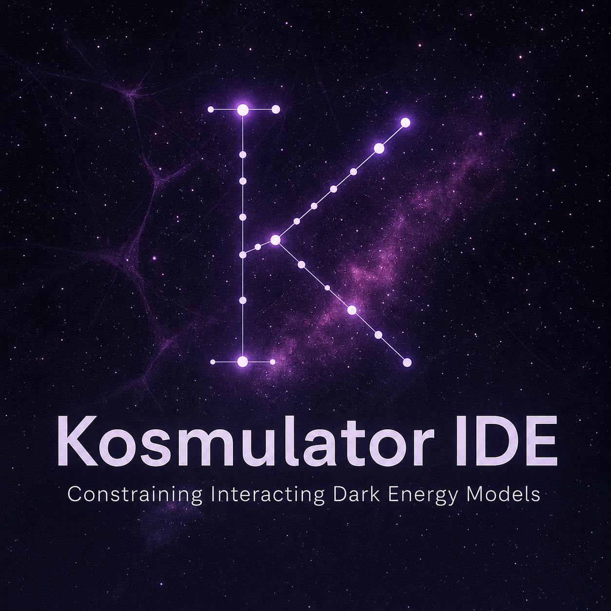

  

# Kosmulator IDE branch: Interacting Dark Energy extensions

For installation instructions, general information about Kosmulator, model selection, dataset selection, sampler configuration, and setting parameter bounds, users should refer to the [`main` branch](https://github.com/renierht/Kosmulator). This branch specifically contains modifications of Kosmulator for **Interacting Dark Energy (IDE)** background models.

The purpose of this branch is to add analytical background solutions for five linear and three non-linear IDE kernels, together with parameter-domain checks that can be used to exclude imaginary or undefined dark-sector densities, negative energy densities, future big-rip singularities, and early-time perturbative instabilities according to the doom-factor analysis.

---

## IDE background equations

Phenomenological IDE models modify the separate conservation equations of dark matter and dark energy by introducing an interaction four-vector $Q^\nu$. At background level, only the energy-transfer kernel $Q$ is required, and the dark-sector conservation equations become

$$
\dot{\rho}_{\rm dm}+3H\rho_{\rm dm}=Q,
\qquad
\dot{\rho}_{\rm de}+3H\rho_{\rm de}(1+w)=-Q.
$$

Here $\rho_{\rm dm}$ and $\rho_{\rm de}$ are the dark matter and dark energy densities, $H$ is the Hubble function, and $w$ is the dark energy equation-of-state parameter. With this sign convention, $Q>0$ corresponds to energy transfer from dark energy to dark matter, while $Q<0$ corresponds to energy transfer from dark matter to dark energy.

The interaction kernel $Q$ is usually taken to be proportional to $H$, one or more dark-sector densities, and a dimensionless coupling parameter $\delta$. In most one-coupling models, $w$ is also kept as a free parameter, so the interacting model typically introduces two additional/free dark-sector parameters to constrain: $\delta$ and $w$. The most general linear model in this branch contains two coupling parameters, $\delta_{\rm dm}$ and $\delta_{\rm de}$, together with $w$.

Throughout this README we define

$$
h(z) \equiv E(z) \equiv \frac{H(z)}{H_0},
\qquad
r_0 \equiv \frac{\Omega_{\rm dm,0}}{\Omega_{\rm de,0}}.
$$

---

## IDE kernels implemented in this branch

### Linear IDE model 1: $Q=3H(\delta_{\rm dm}\rho_{\rm dm}+\delta_{\rm de}\rho_{\rm de})$

For a flat FLRW universe containing radiation, baryons, dark matter, and dark energy, the normalized Hubble function is

$$
\begin{aligned}
h(z)=\{&
-\frac{1}{2\Delta}
\left[\Omega_{\rm de,0}(\delta_{\rm dm}-\delta_{\rm de}+w-\Delta)
+\Omega_{\rm dm,0}(\delta_{\rm dm}-\delta_{\rm de}-w-\Delta)\right]
(1+z)^{-\frac{3}{2}(\delta_{\rm dm}-\delta_{\rm de}-w-2+\Delta)}
\\[1mm]
&+\frac{1}{2\Delta}
\left[\Omega_{\rm de,0}(\delta_{\rm dm}-\delta_{\rm de}+w+\Delta)
+\Omega_{\rm dm,0}(\delta_{\rm dm}-\delta_{\rm de}-w+\Delta)\right]
(1+z)^{-\frac{3}{2}(\delta_{\rm dm}-\delta_{\rm de}-w-2-\Delta)}
\\[1mm]
&+\Omega_{\rm bm,0}(1+z)^3+\Omega_{\rm r,0}(1+z)^4
\}^{1/2},
\end{aligned}
$$
where

$$
\Delta=\sqrt{(\delta_{\rm dm}+\delta_{\rm de}+w)^2-4\delta_{\rm de}\delta_{\rm dm}}.
$$

The sign of $\delta_{\rm dm}$ determines the initial direction of energy transfer, while $\delta_{\rm de}$ determines the late-time direction of energy transfer. A positive coupling corresponds to energy transfer from dark energy to dark matter. If $\delta_{\rm dm}$ and $\delta_{\rm de}$ have opposite signs, the interaction changes direction during the cosmic evolution. Negative dark energy appears in the past when $\delta_{\rm dm}<0$, while negative dark matter appears in the future when $\delta_{\rm de}<0$.

### Linear IDE model 2: $Q=3H\delta(\rho_{\rm dm}+\rho_{\rm de})$

The Hubble function is obtained from the general linear solution above by setting

$$
\delta_{\rm dm}=\delta_{\rm de}=\delta.
$$

For $\delta<0$, corresponding to energy transfer from dark matter to dark energy, this model exhibits negative dark energy densities in the past and negative dark matter densities in the future. For a sufficiently small positive coupling, all dark-sector densities remain positive, provided the positive-energy bounds below are satisfied.

### Linear IDE model 3: $Q=3H\delta(\rho_{\rm dm}-\rho_{\rm de})$

The Hubble function is obtained from the general linear solution by setting

$$
\delta_{\rm dm}=\delta,
\qquad
\delta_{\rm de}=-\delta.
$$

This is a sign-switching interaction. If $\delta<0$, the initial energy flow is from dark matter to dark energy and reverses later, with negative dark energy appearing in the past. If $\delta>0$, the initial energy flow is from dark energy to dark matter and later reverses, with negative dark matter appearing in the future. This kernel has no viable domain in which both dark-sector densities remain positive for all times.

### Linear IDE model 4: $Q=3H\delta\rho_{\rm dm}$

The Hubble function is obtained from the general linear solution by setting

$$
\delta_{\rm dm}=\delta,
\qquad
\delta_{\rm de}=0.
$$

For $\delta<0$, energy flows from dark matter to dark energy and dark energy becomes negative in the past. For a sufficiently small positive coupling, energy flows from dark energy to dark matter and all dark-sector densities can remain positive.

### Linear IDE model 5: $Q=3H\delta\rho_{\rm de}$

The Hubble function is obtained from the general linear solution by setting

$$
\delta_{\rm de}=\delta,
\qquad
\delta_{\rm dm}=0.
$$

For $\delta<0$, energy flows from dark matter to dark energy and dark matter becomes negative in the future. For a sufficiently small positive coupling, energy flows from dark energy to dark matter and all dark-sector densities can remain positive.

### Non-linear IDE model 1: $Q=3H\delta\left(\dfrac{\rho_{\rm dm}\rho_{\rm de}}{\rho_{\rm dm}+\rho_{\rm de}}\right)$

The normalized Hubble function is

$$
\begin{aligned}
h(z)=\Bigg\{&
\Big[\Omega_{\rm dm,0}(1+z)^{3(1-\delta)}
+\Omega_{\rm de,0}(1+z)^{3(1+w)}\Big]
\left[
\frac{1+r_0(1+z)^{-3(w+\delta)}}{1+r_0}
\right]^{-\frac{\delta}{w+\delta}}
\\[1mm]
&+\Omega_{\rm bm,0}(1+z)^3+\Omega_{\rm r,0}(1+z)^4
\Bigg\}^{1/2}.
\end{aligned}
$$

This interaction always gives positive dark-sector densities, independently of the sign or magnitude of $\delta$.

### Non-linear IDE model 2: $Q=3H\delta\left(\dfrac{\rho_{\rm dm}^2}{\rho_{\rm dm}+\rho_{\rm de}}\right)$

The normalized Hubble function is

$$
\begin{aligned}
h(z)=\{&
\left[\Omega_{\rm dm,0}
+\Omega_{\rm de,0}
\left(
\frac{[w+\delta r_0](1+z)^{3w}-\delta r_0}{w}
\right)\right]
(1+z)^{3\left(1-\frac{w\delta}{w-\delta}\right)}
\\[1mm]
&\times
\left[
\frac{[w+\delta r_0](1+z)^{3w}+r_0(w-\delta)}{w(1+r_0)}
\right]^{\frac{\delta}{w-\delta}}
+\Omega_{\rm bm,0}(1+z)^3+\Omega_{\rm r,0}(1+z)^4
\}^{1/2}.
\end{aligned}
$$

For $\delta<0$, energy flows from dark matter to dark energy and dark energy becomes negative in the past. For a sufficiently small positive coupling, energy flows from dark energy to dark matter and all dark-sector densities can remain positive.

### Non-linear IDE model 3: $Q=3H\delta\left(\dfrac{\rho_{\rm de}^2}{\rho_{\rm dm}+\rho_{\rm de}}\right)$

The normalized Hubble function is

$$
\begin{aligned}
h(z)=\{&
\left[\Omega_{\rm dm,0}
\left(
\frac{(wr_0+\delta)(1+z)^{-3w}-\delta}{wr_0}
\right)
+\Omega_{\rm de,0}\right]
(1+z)^{3\left(1+\frac{w^2}{w-\delta}\right)}
\\[1mm]
&\times
\left[
\frac{(wr_0+\delta)(1+z)^{-3w}+w-\delta}{w(1+r_0)}
\right]^{\frac{\delta}{w-\delta}}
+\Omega_{\rm bm,0}(1+z)^3+\Omega_{\rm r,0}(1+z)^4
\}^{1/2}.
\end{aligned}
$$

For $\delta<0$, energy flows from dark matter to dark energy and dark matter becomes negative in the future. For a sufficiently small positive coupling, energy flows from dark energy to dark matter and all dark-sector densities can remain positive.

---

## Enforced regularity bounds

Bounds have been enforced on each $h(z)$ over the evaluated cosmological domain to prevent undefined or imaginary dark-sector densities from entering the likelihood calculation.

| Interaction $Q$ | Conditions to avoid imaginary $\rho_{\rm dm/de}$ | Conditions to avoid undefined $\rho_{\rm dm/de}$ |
|---|---|---|
| $3H(\delta_{\rm dm}\rho_{\rm dm}+\delta_{\rm de}\rho_{\rm de})$ | $(\delta_{\rm dm}+\delta_{\rm de}+w)^2>4\delta_{\rm de}\delta_{\rm dm}$ | $w\ne0$; $(\delta_{\rm dm}+\delta_{\rm de}+w)^2-4\delta_{\rm de}\delta_{\rm dm}\ne0$ |
| $3H\delta(\rho_{\rm dm}+\rho_{\rm de})$ | $\delta\le -w/4$ | $w\ne0$; $\delta\ne -w/4$ |
| $3H\delta(\rho_{\rm dm}-\rho_{\rm de})$ | $\rho_{\rm dm/de}$ always real | $w\ne0$ |
| $3H\delta\rho_{\rm dm}$ | $\rho_{\rm dm/de}$ always real | $\delta\ne -w$ |
| $3H\delta\rho_{\rm de}$ | $\rho_{\rm dm/de}$ always real | $\delta\ne -w$ |
| $3H\delta\left(\dfrac{\rho_{\rm dm}\rho_{\rm de}}{\rho_{\rm dm}+\rho_{\rm de}}\right)$ | $\rho_{\rm dm/de}$ always real | $\delta\ne -w$ |
| $3H\delta\left(\dfrac{\rho_{\rm dm}^2}{\rho_{\rm dm}+\rho_{\rm de}}\right)$ | $\rho_{\rm dm/de}$ always real | $w<0$; $w<\delta\le -w/r_0$ |
| $3H\delta\left(\dfrac{\rho_{\rm de}^2}{\rho_{\rm dm}+\rho_{\rm de}}\right)$ | $\rho_{\rm dm/de}$ always real | $w<0$; $w<\delta\le -wr_0$ |

**Table 1.** Conditions required to avoid imaginary or undefined energy densities for the different interaction kernels. Here $r_0=\Omega_{\rm dm,0}/\Omega_{\rm de,0}$.

---

## Optional physical-domain switches

Additional switches have been added so that users can decide whether to allow or reject parameter points associated with:

1. negative dark matter or dark energy densities;
2. future big-rip singularities;
3. early-time instabilities based on the doom-factor analysis of Gavela et al. (2009).

The positive-energy conditions also ensure that past big-bounce solutions and future big-crunch solutions are avoided in flat universes.

| Interaction $Q$ | $\rho_{\rm dm/de}>0$ domain | $\rho_{\rm dm/de}>0$ conditions | No future big rip |
|---|---|---|---|
| $3H(\delta_{\rm dm}\rho_{\rm dm}+\delta_{\rm de}\rho_{\rm de})$ | DE $\rightarrow$ DM | $\delta_{\rm dm}\ge0$; $\delta_{\rm de}\ge0$; $\delta_{\rm dm}r_0+\delta_{\rm de}\le -\dfrac{wr_0}{1+r_0}$ | $\delta_{\rm dm}(w+1)-\delta_{\rm de}\le w+1$ |
| $3H\delta(\rho_{\rm dm}+\rho_{\rm de})$ | DE $\rightarrow$ DM | $0\le\delta\le -\dfrac{wr_0}{(1+r_0)^2}$ | $\delta\ge 1+\dfrac{1}{w}$ |
| $3H\delta(\rho_{\rm dm}-\rho_{\rm de})$ | No viable domain | No viable domain | $\delta\le\dfrac{1+w}{2+w}$ |
| $3H\delta\rho_{\rm dm}$ | DE $\rightarrow$ DM | $0\le\delta\le -\dfrac{w}{1+r_0}$ | $w>-1$ |
| $3H\delta\rho_{\rm de}$ | DE $\rightarrow$ DM | $0\le\delta\le -\dfrac{w}{1+1/r_0}$ | $\delta\ge -w-1$ |
| $3H\delta\left(\dfrac{\rho_{\rm dm}\rho_{\rm de}}{\rho_{\rm dm}+\rho_{\rm de}}\right)$ | DE $\leftrightarrow$ DM | $\forall\delta$ | $w\ge -1$ |
| $3H\delta\left(\dfrac{\rho_{\rm dm}^2}{\rho_{\rm dm}+\rho_{\rm de}}\right)$ | DE $\rightarrow$ DM | $0\le\delta\le -\dfrac{w}{r_0}$ | $w\ge -1$ |
| $3H\delta\left(\dfrac{\rho_{\rm de}^2}{\rho_{\rm dm}+\rho_{\rm de}}\right)$ | DE $\rightarrow$ DM | $0\le\delta\le -wr_0$ | $\delta\ge w(w+1)$ |

**Table 2.** Conditions required to ensure positive energy densities and avoid future big-rip singularities for the different interaction kernels. Here $r_0=\Omega_{\rm dm,0}/\Omega_{\rm de,0}$.

---

## Doom-factor stability switches

The doom-factor condition is used here as a preliminary background-level stability filter. The implementation follows the narrow early-time interpretation used by Gavela et al. (2009): the sign of the doom factor $d$ is evaluated in the early-time branch, without globally discarding branches where $\rho_{\rm de}$ may become negative.

| Interaction $Q$ | Doom factor $d$ | Doom-factor stability | Doom stability plus positive-energy condition |
|---|---|---|---|
| $3H(\delta_{\rm dm}\rho_{\rm dm}+\delta_{\rm de}\rho_{\rm de})$ | $d=\dfrac{\delta_{\rm dm}r+\delta_{\rm de}}{1+w}$ | $\delta_{\rm de}>0$; $\delta_{\rm dm}\in\mathbb{R}$; $w<-1$ | $\delta_{\rm dm}\ge0$; $\delta_{\rm de}\ge0$; $\delta_{\rm dm}r_0+\delta_{\rm de}\le -\dfrac{wr_0}{1+r_0}$; $w<-1$ |
| $3H\delta(\rho_{\rm dm}+\rho_{\rm de})$ | $d=\dfrac{\delta(r+1)}{1+w}$ | $w<-1$ | $0<\delta\le -\dfrac{wr_0}{(1+r_0)^2}$; $w<-1$ |
| $3H\delta(\rho_{\rm dm}-\rho_{\rm de})$ | $d=\dfrac{\delta(r-1)}{1+w}$ | $w<-1$ | No viable positive-energy domain |
| $3H\delta\rho_{\rm dm}$ | $d=\dfrac{\delta r}{1+w}$ | $w<-1$ | $0<\delta\le -\dfrac{w}{1+r_0}$; $w<-1$ |
| $3H\delta\rho_{\rm de}$ | $d=\dfrac{\delta}{1+w}$ | $\delta(1+w)<0$ | $0<\delta\le -\dfrac{w}{1+1/r_0}$; $w<-1$ |
| $3H\delta\dfrac{\rho_{\rm dm}\rho_{\rm de}}{\rho_{\rm dm}+\rho_{\rm de}}$ | $d=\dfrac{\delta r}{(1+r)(1+w)}$ | $\delta(1+w)<0$ | No additional positive-energy bound; only $\delta(1+w)<0$ |
| $3H\delta\dfrac{\rho_{\rm dm}^2}{\rho_{\rm dm}+\rho_{\rm de}}$ | $d=\dfrac{\delta r^2}{(1+r)(1+w)}$ | $w<-1$ | $0<\delta\le -\dfrac{w}{r_0}$; $w<-1$ |
| $3H\delta\dfrac{\rho_{\rm de}^2}{\rho_{\rm dm}+\rho_{\rm de}}$ | $d=\dfrac{\delta}{(1+r)(1+w)}$ | $\delta(1+w)<0$ | $0<\delta\le -wr_0$; $w<-1$ |

**Table 3.** Doom-factor stability conditions for the five linear and three non-linear interacting dark energy kernels. The doom-factor-only column follows the narrow early-time Gavela interpretation. The final column combines the early-time doom-factor condition with the corresponding positive-energy bounds.

---

## Current limitations

This branch currently implements the analytical background expansion histories and the associated background-level parameter-domain checks. The perturbation equations required for consistent CMB constraints have not yet been implemented for these IDE models. For this reason, the doom-factor analysis used here should be treated as preliminary while the perturbation sector is being added.

---

## References

Users should also cite the original observational datasets used in any Kosmulator analysis; see the `main` branch README for the general Kosmulator and dataset references.

### Analytical solutions and positive-energy conditions

1. M. van der Westhuizen, A. Abebe, and E. Di Valentino, *Phys. Dark Univ.* **50**, 102119 (2025), arXiv:2509.04495 [gr-qc].
2. M. van der Westhuizen, A. Abebe, and E. Di Valentino, *Phys. Dark Univ.* **50**, 102120 (2025), arXiv:2509.04494 [gr-qc].
3. M. van der Westhuizen, A. Abebe, and E. Di Valentino, *Phys. Dark Univ.* **50**, 102121 (2025), arXiv:2509.04496 [gr-qc].

### Crunching and bouncing cosmologies

4. M. van der Westhuizen and A. Abebe, *Class. Quantum Grav.* (2026), https://doi.org/10.1088/1361-6382/ae849d.

### Doom-factor analysis

5. M. Gavela, D. Hernandez, L. Lopez Honorez, O. Mena, and S. Rigolin, *J. Cosmol. Astropart. Phys.* **2009**(07), 034.

### Previous observational constraints using these analytical solutions

6. M. van der Westhuizen, D. Figueruelo, R. Thubisi, S. Sahlu, A. Abebe, and A. Paliathanasis, *Phys. Dark Univ.* **50**, 102107 (2025), arXiv:2505.23306 [astro-ph.CO].
7. D. Figueruelo, M. van der Westhuizen, A. Abebe, and E. Di Valentino, *Phys. Dark Univ.* **52**, 102238 (2026).
